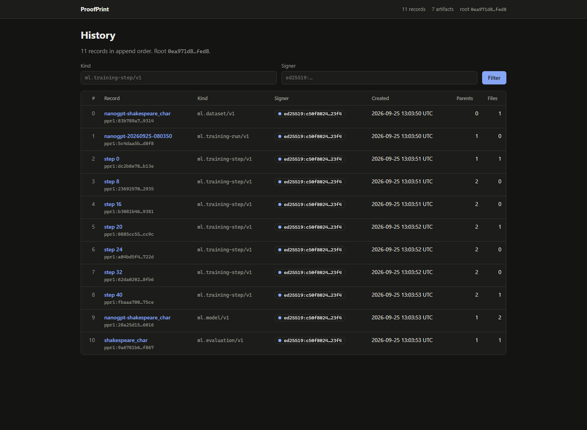
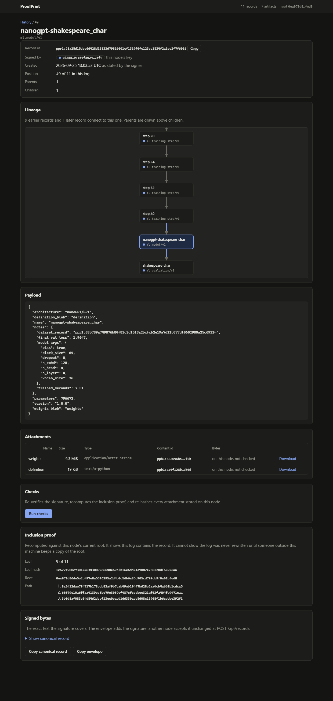

# ProofPrint

Signed, linked records for datasets, training runs, checkpoints, and evaluations,
kept in an append-only log that anyone holding the records can check.

Each record states one thing: this dataset, this run config, this checkpoint,
this score, or someone else's check of that score. It is signed with Ed25519,
names the records it was built from, refers to files by content hash, and gets
a position in a Merkle log. From the records alone you can check that the
stated key signed exactly these bytes, that the files match their hashes, and
what each result was built on.

A record does not make its claim true. "Lab A says it trained on dataset D" is
what a signature shows. Whether it did is for someone else to check, and that
check is itself a record with its own signature.

## Status

Working on one machine:

- `proofprint-core`: records, signing, content-addressed files, Merkle log, recovery from interrupted writes
- `proofprint`: command-line tool over a local log
- `proofprint-node`: local HTTP node that signs, stores, and serves records
- `explorer/`: React app for browsing a node: history, lineage graph, checks, proofs
- `python/`: client with a training recorder and a Hugging Face `Trainer` callback

Not built yet: independently witnessed log roots, public hosting, replication.
Until roots are witnessed, the operator of a log can rewrite it without anyone
else noticing. See [docs/whats-next.md](docs/whats-next.md).

## See it with example data

Needs stable Rust and Node.js 20 or later. From the repository root:

```bash
cd explorer
npm ci
npm run build
cd ..
cargo run -p proofprint-node -- --demo --data target/demo-data
```

Open <http://127.0.0.1:4780>. `--demo` fills an empty log with eight labeled
example records from two keys: a dataset, a run, two steps, a model, an
evaluation, a second party's re-run, and that party's verification. None of it
describes real training.



A record page shows the same record's lineage, payload, attachments, and the
result of re-checking its signature, inclusion proof, and stored files:



## Record your own training

Start a node, which creates `.proofprint/keys/default.key` on first run:

```bash
cargo run -p proofprint-node
```

Then, from Python:

```python
from proofprint import NodeClient, Publisher, TrainingRecorder

client = NodeClient()
dataset = Publisher(client).dataset("tickets", "2026.09", origin="export", manifest="manifest.txt")

run = TrainingRecorder(client, run_id="ft-1", framework="pytorch/2.8", config={"lr": 3e-4}, parents=[dataset.id])
run.step(100, loss=1.92)
run.step(200, loss=1.41, checkpoint="out/model.safetensors")
model = run.model("ticket-router", "1.0.0", "transformer-encoder", weights="out/model.safetensors")
```

With `transformers`, pass `RecordingCallback` to the `Trainer` instead. See
[python/README.md](python/README.md).

## Train nanoGPT and watch it land

[examples/nanogpt/train_recorded.py](examples/nanogpt/train_recorded.py) runs a
small [nanoGPT](https://github.com/karpathy/nanoGPT) training loop and publishes
the chain as it goes: a dataset record with a manifest of file hashes, a run
record with the config and the nanoGPT commit, a record per logged step with its
loss, the checkpoint, the resulting model, and a final evaluation. It is small
enough to finish on a CPU in under a minute.

```bash
cargo run -p proofprint-node
# in another terminal
python examples/nanogpt/train_recorded.py --nanogpt /path/to/nanoGPT
```

It prints the explorer URL for the resulting model. The same four calls
(`dataset`, `TrainingRecorder`, `step`, `model`) drop into nanoGPT's own
`train.py`; see [examples/nanogpt/README.md](examples/nanogpt/README.md).

## Command line

```bash
cargo run -p proofprint-cli -- init
cargo run -p proofprint-cli -- keygen
cargo run -p proofprint-cli -- publish --kind example.note/v1 --payload @examples/note.json --blob source=README.md
cargo run -p proofprint-cli -- log
cargo run -p proofprint-cli -- verify --all
```

`publish` prints the new record's `ppr1:...` id. Pass it to `get`, `verify`,
`prove`, or `tree`, or to `publish --parent` to link a new record to it. In
PowerShell, quote `'@examples/note.json'` so `@` is not read as splatting.

| Command | Purpose |
| --- | --- |
| `init` | Create the local storage directories |
| `keygen`, `whoami` | Create a signing key or print its public identifier |
| `publish` | Sign and append a record with optional parents and file attachments |
| `get` | Print a stored record or its payload |
| `verify <id>`, `verify --all` | Check signatures and stored files; single-record mode also checks inclusion |
| `log`, `root` | List records, print the current root |
| `prove` | Print an inclusion proof against the current root |
| `tree` | List ancestors and descendants |
| `blob add/get/check/stats` | Manage stored files |
| `schemas` | List the bundled record kinds |

`--data <dir>` picks a log, `--key <path>` a signing key, and `--json` switches
to JSON output. `PROOFPRINT_DATA` and `PROOFPRINT_KEY` work too. The CLI and
the node cannot open the same directory at once.

## HTTP API

The node listens on `127.0.0.1:4780` and has no authentication. It refuses a
non-loopback address unless started with `--allow-remote`.

| Method | Path | Purpose |
| --- | --- | --- |
| GET | `/api/status` | Record and file counts, current root, the node's signing key |
| GET | `/api/records?kind=&signer=&offset=&limit=` | Records in log order |
| GET | `/api/records/{id}` | Signed record, its exact signed bytes, file availability, children |
| GET | `/api/records/{id}/tree` | Ancestors, descendants, and parents this log lacks |
| GET | `/api/records/{id}/proof` | Inclusion proof against the node's current root |
| POST | `/api/records/{id}/verify` | Re-check signature, inclusion, and stored file bytes |
| POST | `/api/records` | Append a record signed elsewhere |
| POST | `/api/publish` | Sign a draft with the node's key and append it |
| POST | `/api/artifacts` | Upload one file (multipart) and get its reference |
| GET | `/api/artifacts/{id}` | Download a stored file |

## Layout

```text
crates/proofprint-core/   Records, signing, file store, Merkle log, schemas
crates/proofprint-cli/    Command-line tool
crates/proofprint-node/   HTTP node and demo data
explorer/                 React app served by the node from explorer/dist
python/                   Python client
spec/v1/record.md         Record format, identifiers, Merkle rules
spec/v1/vectors.json      Frozen signed records, ids, roots, and proofs
docs/                     Architecture and plans
examples/nanogpt/         Recording a nanoGPT training run, step by step
```

A data directory looks like this:

```text
.proofprint/
  keys/default.key          Unencrypted signing seed; keep it out of version control
  blobs/<shard>/<hash>.bin  Stored files
  log/records.ndjson        Signed records, one per line
  log/writer.lock           Held by whichever process has the log open
```

## Limits

- A signature ties a record to a key, not to a person or company.
- An inclusion proof ties a record to one root of one log. Detecting a
  rewritten log needs someone outside to keep earlier roots.
- `created` is the signer's own statement, not a certified time.
- A file can be missing without being corrupt. Checks report the two separately.
- On open, an unfinished last line from an interrupted write is dropped and
  reported. Any other damage stops the log from opening.
- The whole log is held in memory, and roots and proofs are rebuilt in O(n).
- The v1 encoding is this project's own deterministic JSON, not RFC 8785.
  Other implementations should test against `spec/v1/vectors.json`.

## Development

```bash
cargo fmt --all -- --check
cargo clippy --workspace --all-targets --locked -- -D warnings
cargo test --workspace --locked
cd explorer && npm test && npm run build
cd python && python -m unittest discover -s tests -t .
```

See [CONTRIBUTING.md](CONTRIBUTING.md).
